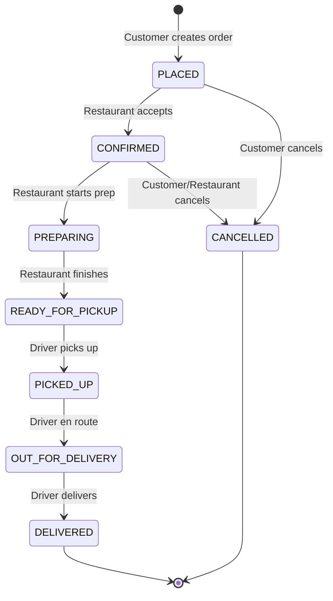

# Food Delivery Order Management API

A robust REST API built in **Go** for managing food delivery orders — similar to Uber Eats or DoorDash. The system coordinates three user types (Customers, Restaurants, Drivers) through a complete order lifecycle using a **role-gated state machine** that prevents invalid transitions.

---

## Features

- **Order Lifecycle Management** — Full state machine from placement to delivery
- **Role-Based Access Control** — Each transition is restricted to the appropriate user role
- **Invalid Transition Prevention** — State machine validates both transition legality and role authorization
- **Order Status History** — Complete audit trail of every state change
- **Concurrency Safe** — Thread-safe in-memory storage using `sync.RWMutex`
- **Cancellation Support** — Orders can be cancelled in early stages

---

## Architecture

```
┌──────────────────────────────────────────────────────┐
│                    main.go                           │
│         (Router setup, server bootstrap)             │
├──────────────────────────────────────────────────────┤
│                   handlers/                          │
│   middleware.go  │ order_handler.go │ user_handler.go│
│   response.go   │                  │                 │
├──────────────────────────────────────────────────────┤
│               statemachine/                          │
│    statemachine.go (transition map + validation)     │
├──────────────────────────────────────────────────────┤
│     models/           │         db/                  │
│  order.go  user.go    │   db.go (in-memory store)    │
└──────────────────────────────────────────────────────┘
```

| Layer | Responsibility |
|---|---|
| `handlers/` | HTTP request handling, input validation, response formatting |
| `statemachine/` | Order state transition validation with role-gating |
| `models/` | Data structures (Order, User, StatusChange) |
| `db/` | Thread-safe in-memory data store |

---

## Order State Machine



### Transition Rules

| From | To | Allowed Role(s) |
|------|-----|-----------------|
| `PLACED` | `CONFIRMED` | Restaurant |
| `PLACED` | `CANCELLED` | Customer |
| `CONFIRMED` | `PREPARING` | Restaurant |
| `CONFIRMED` | `CANCELLED` | Customer, Restaurant |
| `PREPARING` | `READY_FOR_PICKUP` | Restaurant |
| `READY_FOR_PICKUP` | `PICKED_UP` | Driver |
| `PICKED_UP` | `OUT_FOR_DELIVERY` | Driver |
| `OUT_FOR_DELIVERY` | `DELIVERED` | Driver |

**Terminal states:** `DELIVERED` and `CANCELLED` — no further transitions allowed.

### How Invalid Transitions Are Prevented

1. **Transition Map** — A statically defined map (`transitionMap`) in `statemachine/statemachine.go` lists every valid `(from_status → to_status)` pair. Any transition not in this map is rejected with HTTP 400.
2. **Role Gating** — Each transition entry also specifies which roles may perform it. If the transition is valid but the caller's role doesn't match, the request is rejected with HTTP 403.
3. **Terminal States** — `DELIVERED` and `CANCELLED` have no outgoing transitions in the map, making them impossible to transition away from.
4. **Atomic Updates** — The in-memory store uses `sync.RWMutex` to prevent race conditions during concurrent status updates.

---

## Getting Started

### Prerequisites

- **Go 1.21+** installed

### Run the Server

```bash
go mod tidy
go run main.go
```

The server starts on `http://localhost:8080`.

---

## API Reference

All order endpoints require authentication headers:
- `X-User-ID` — The user's ID
- `X-User-Role` — The user's role (`customer`, `restaurant`, or `driver`)

### Users

#### Register User
```bash
POST /api/users
Content-Type: application/json

{
  "name": "Alice",
  "role": "customer"
}
```
**Response (201):**
```json
{
  "id": "uuid-here",
  "name": "Alice",
  "role": "customer"
}
```

#### Get User
```bash
GET /api/users/{id}
```

---

### Orders

#### Create Order (Customer only)
```bash
POST /api/orders
X-User-ID: <customer_id>
X-User-Role: customer
Content-Type: application/json

{
  "restaurant_id": "<restaurant_id>",
  "items": [
    {"name": "Margherita Pizza", "quantity": 2, "price": 12.99},
    {"name": "Garlic Bread", "quantity": 1, "price": 4.99}
  ],
  "delivery_address": "123 Main St, Apt 4B"
}
```
**Response (201):** Full order object with status `PLACED`.

#### List Orders
```bash
GET /api/orders
X-User-ID: <user_id>
X-User-Role: <role>

# Optional status filter:
GET /api/orders?status=PLACED
```

#### Get Order
```bash
GET /api/orders/{id}
X-User-ID: <user_id>
X-User-Role: <role>
```

#### Update Order Status
```bash
PATCH /api/orders/{id}/status
X-User-ID: <user_id>
X-User-Role: <role>
Content-Type: application/json

{
  "status": "CONFIRMED"
}
```
**Success (200):** Updated order object.
**Invalid transition (400):** `{"error": "invalid transition from 'PLACED' to 'DELIVERED'; valid transitions: [CONFIRMED CANCELLED]"}`
**Wrong role (403):** `{"error": "role 'customer' is not authorized to transition order from 'PLACED' to 'CONFIRMED'"}`

#### Get Order History
```bash
GET /api/orders/{id}/history
X-User-ID: <user_id>
X-User-Role: <role>
```
**Response (200):** Array of status change records with timestamps.

#### Get Allowed Transitions
```bash
GET /api/orders/{id}/transitions
X-User-ID: <user_id>
X-User-Role: <role>
```
**Response (200):**
```json
{
  "current_status": "PLACED",
  "allowed_transitions": ["CONFIRMED"]
}
```

#### Health Check
```bash
GET /health
```

---

## Example: Full Order Lifecycle

```bash
# 1. Register users
curl -s -X POST http://localhost:8080/api/users \
  -H "Content-Type: application/json" \
  -d '{"name":"Alice","role":"customer"}'

curl -s -X POST http://localhost:8080/api/users \
  -H "Content-Type: application/json" \
  -d '{"name":"Pizza Palace","role":"restaurant"}'

curl -s -X POST http://localhost:8080/api/users \
  -H "Content-Type: application/json" \
  -d '{"name":"Bob Driver","role":"driver"}'

# 2. Customer places order
curl -s -X POST http://localhost:8080/api/orders \
  -H "Content-Type: application/json" \
  -H "X-User-ID: <CUSTOMER_ID>" -H "X-User-Role: customer" \
  -d '{"restaurant_id":"<RESTAURANT_ID>","items":[{"name":"Margherita Pizza","quantity":2,"price":12.99}],"delivery_address":"123 Main St"}'

# 3. Restaurant confirms → prepares → marks ready
curl -s -X PATCH http://localhost:8080/api/orders/<ORDER_ID>/status \
  -H "Content-Type: application/json" \
  -H "X-User-ID: <RESTAURANT_ID>" -H "X-User-Role: restaurant" \
  -d '{"status":"CONFIRMED"}'

curl -s -X PATCH http://localhost:8080/api/orders/<ORDER_ID>/status \
  -H "Content-Type: application/json" \
  -H "X-User-ID: <RESTAURANT_ID>" -H "X-User-Role: restaurant" \
  -d '{"status":"PREPARING"}'

curl -s -X PATCH http://localhost:8080/api/orders/<ORDER_ID>/status \
  -H "Content-Type: application/json" \
  -H "X-User-ID: <RESTAURANT_ID>" -H "X-User-Role: restaurant" \
  -d '{"status":"READY_FOR_PICKUP"}'

# 4. Driver picks up → delivers
curl -s -X PATCH http://localhost:8080/api/orders/<ORDER_ID>/status \
  -H "Content-Type: application/json" \
  -H "X-User-ID: <DRIVER_ID>" -H "X-User-Role: driver" \
  -d '{"status":"PICKED_UP"}'

curl -s -X PATCH http://localhost:8080/api/orders/<ORDER_ID>/status \
  -H "Content-Type: application/json" \
  -H "X-User-ID: <DRIVER_ID>" -H "X-User-Role: driver" \
  -d '{"status":"OUT_FOR_DELIVERY"}'

curl -s -X PATCH http://localhost:8080/api/orders/<ORDER_ID>/status \
  -H "Content-Type: application/json" \
  -H "X-User-ID: <DRIVER_ID>" -H "X-User-Role: driver" \
  -d '{"status":"DELIVERED"}'

# 5. View complete order history
curl -s http://localhost:8080/api/orders/<ORDER_ID>/history \
  -H "X-User-ID: <CUSTOMER_ID>" -H "X-User-Role: customer"
```

---

## Project Structure

```
food-delivery-api/
├── main.go                    # Entry point, router setup
├── go.mod                     # Go module dependencies
├── go.sum                     # Dependency checksums
├── models/
│   ├── order.go               # Order, OrderItem, StatusChange structs
│   └── user.go                # User, Role structs
├── db/
│   └── db.go                  # Thread-safe in-memory store
├── statemachine/
│   └── statemachine.go        # State transition validation engine
├── handlers/
│   ├── middleware.go           # Auth header extraction middleware
│   ├── order_handler.go        # Order CRUD + status endpoints
│   ├── user_handler.go         # User registration endpoint
│   └── response.go             # JSON response helpers
├── docs/
│   ├── design.md               # Design document
│   └── state-machine.md        # State machine diagram & docs
├── prompts/
│   └── ai-prompts.md           # AI prompts used
└── README.md                   # This file
```

---

## Tech Stack

| Component | Choice | Reason |
|-----------|--------|--------|
| Language | Go | Required by project spec |
| Router | gorilla/mux | Mature, supports path params and middleware |
| IDs | google/uuid | RFC 4122 UUID generation |
| Database | In-memory (sync.RWMutex) | Zero external dependencies |
