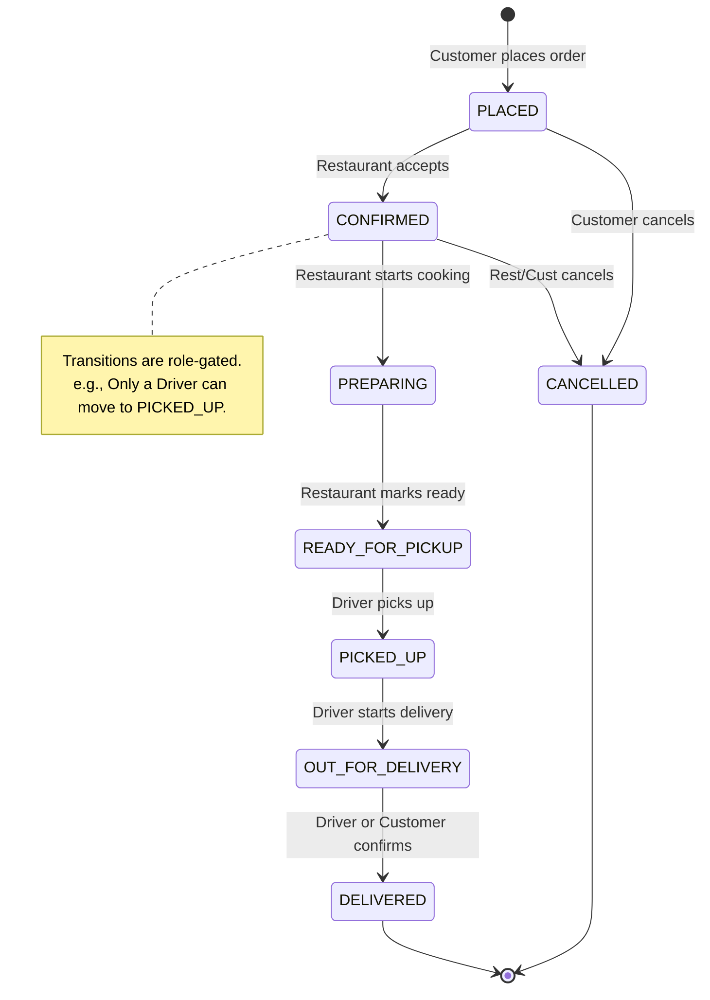

# FoodDash Management API

A robust REST API built in **Go** for managing food delivery orders — similar to Uber Eats or DoorDash. The system coordinates three user types (Customers, Restaurants, Drivers) through a complete order lifecycle using a **role-gated state machine** that prevents invalid transitions.

---

## Features

- **Order Lifecycle Management** — Full state machine from placement to delivery
- **Role-Based Access Control** — Each transition is restricted to the appropriate user role
- **Invalid Transition Prevention** — State machine validates both transition legality and role authorization
- **Order Status History** — Complete audit trail of every state change
- **MongoDB Persistence** — All users, orders, and menu items are persisted in MongoDB
- **Interactive Dashboard** — Beautiful frontend with role-specific views
- **Light/Dark Mode** — Sleek theme toggle with persistent preferences
- **Accessibility Focused** — High-legibility UI with larger font sizes
- **Payment Options** — Choice of Cash, Card, or QR Code during checkout
- **Customer Confirmation** — Customers can mark orders as "Delivered" once in transit

---

## Architecture

```
┌──────────────────────────────────────────────────────┐
│                    main.go                           │
│         (Router setup, server bootstrap)             │
├──────────────────────────────────────────────────────┤
│                   handlers/                          │
│   middleware.go  │ order_handler.go │ user_handler.go│
│   response.go    │ menu_handler.go  │                │
├──────────────────────────────────────────────────────┤
│               statemachine/                          │
│    statemachine.go (transition map + validation)     │
├──────────────────────────────────────────────────────┤
│     models/           │         db/                  │
│  order.go  user.go    │   db.go (MongoDB Wrapper)    │
│  menu.go              │                              │
├──────────────────────────────────────────────────────┤
│                   static/                            │
│           index.html (Web Dashboard)                  │
└──────────────────────────────────────────────────────┘
```

| Layer | Responsibility |
|---|---|
| `handlers/` | HTTP request handling, input validation, response formatting |
| `statemachine/` | Order state transition validation with role-gating |
| `models/` | Data structures (Order, User, Menu, StatusChange) |
| `db/` | MongoDB client and CRUD operations |
| `static/` | Single-page web dashboard for interacting with the API |

---

## Order Lifecycle

The system enforces a strict state machine. Transitions are only possible between specific states and are role-restricted.



---

## Getting Started

### Prerequisites

- **Go 1.21+** installed
- **MongoDB** installed and running locally on port `27017`

### Start MongoDB
If MongoDB is not running, start it via Services or command line:
```powershell
# Windows Example
net start MongoDB
```

### Run the Server

```bash
go mod tidy
go run main.go
```

The server starts on `http://localhost:8080`. Open this URL in your browser to access the dashboard.

---

## API Reference

All order endpoints require authentication headers:
- `X-User-ID` — The user's ID
- `X-User-Role` — The user's role (`customer`, `restaurant`, or `driver`)

### Users

#### Register User
```bash
POST /api/users
Content-Type: application/json

{
  "name": "Alice",
  "role": "customer"
}
```

#### Get User
```bash
GET /api/users/{id}
```

---

### Orders

#### Create Order (Customer only)
```bash
POST /api/orders
X-User-ID: <customer_id>
X-User-Role: customer
Content-Type: application/json

{
  "restaurant_id": "<restaurant_id>",
  "items": [
    {"name": "Margherita Pizza", "quantity": 2, "price": 12.99},
    {"name": "Garlic Bread", "quantity": 1, "price": 4.99}
  ],
  "delivery_address": "123 Main St, Apt 4B",
  "payment_method": "Credit Card"
}
```

#### Update Order Status
```bash
PATCH /api/orders/{id}/status
X-User-ID: <user_id>
X-User-Role: <role>
Content-Type: application/json

{
  "status": "CONFIRMED"
}
```

---

## Example: Full Order Lifecycle

1. **Open Dashboard**: Go to `http://localhost:8080`
2. **Register**: Create accounts for Customer, Restaurant, and Driver
3. **Menu**: As a Restaurant, add items to your menu
4. **Order**: As a Customer, place an order
5. **Flow**: Follow the state machine transitions (Placed → Confirmed → Preparing → Ready → Picked Up → Delivered)

---

## AI Development Prompts

This project was developed using agentic AI assistance. Below are 5 key prompts used to shape the core features:

1. **Architecture & Persistence**: "Integrate MongoDB to persist users, orders, and menu items, replacing the initial in-memory storage with the `go.mongodb.org/mongo-driver`."
2. **Theming**: "Implement a functional Light/Dark mode toggle using CSS variables and JavaScript, ensuring the preference is saved in `localStorage`."
3. **UX Improvement**: "Update the UI to use a professional, muted slate-blue and gray color palette. Use larger font sizes (base 18px) across all elements to ensure maximum legibility."
4. **Order Workflow**: "Implement a menu system where restaurants can add dishes with descriptions and prices, and customers can add multiple items to their cart."
5. **Feature Expansion**: "Add a payment method selection for customers (Cash, Card, QR) and update the state machine to allow customers to confirm delivery themselves once the order is 'Out for Delivery'."

---

## Tech Stack

| Component | Choice | Reason |
|-----------|--------|--------|
| Language | Go | Performance and strong typing |
| Router | gorilla/mux | Flexible routing and middleware |
| Database | MongoDB | Scalable document-based storage |
| Frontend | Vanilla JS/CSS/HTML | zero-build single-page application |
| Icons | Emojis | Cross-platform compatibility without assets |
