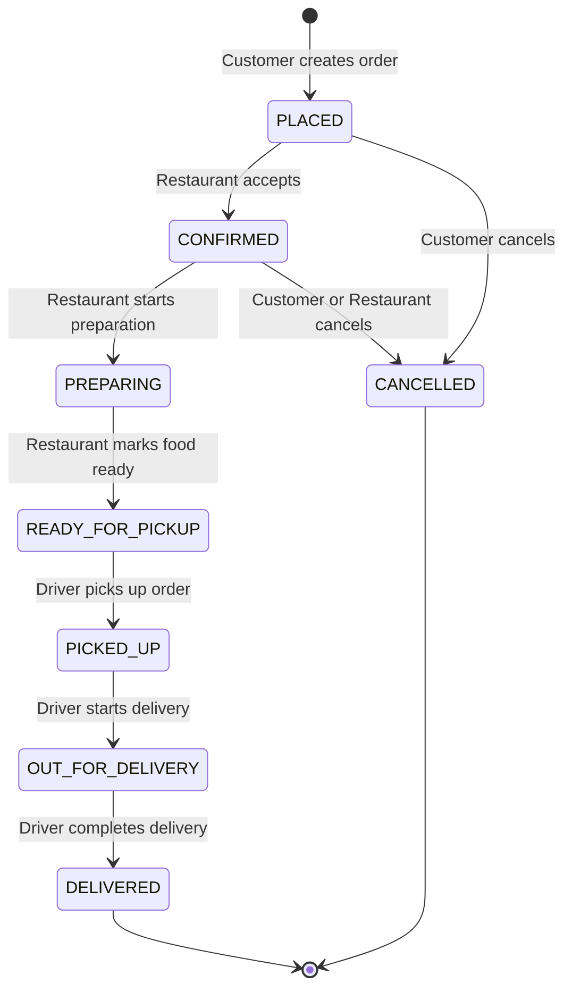

# Order State Machine

## State Diagram (Mermaid)

## States

| State | Description | Actor |
|-------|-------------|-------|
| `PLACED` | Order created by customer, waiting for restaurant | Customer |
| `CONFIRMED` | Restaurant has accepted the order | Restaurant |
| `PREPARING` | Restaurant is preparing the food | Restaurant |
| `READY_FOR_PICKUP` | Food is ready, waiting for driver | Restaurant |
| `PICKED_UP` | Driver has picked up the order | Driver |
| `OUT_FOR_DELIVERY` | Driver is en route to customer | Driver |
| `DELIVERED` | Order delivered to customer (terminal) | Driver |
| `CANCELLED` | Order was cancelled (terminal) | Customer/Restaurant |

## Transition Table

| # | From | To | Allowed Role(s) | Description |
|---|------|-----|-----------------|-------------|
| 1 | `PLACED` | `CONFIRMED` | Restaurant | Restaurant accepts the incoming order |
| 2 | `PLACED` | `CANCELLED` | Customer | Customer cancels before restaurant confirms |
| 3 | `CONFIRMED` | `PREPARING` | Restaurant | Restaurant begins food preparation |
| 4 | `CONFIRMED` | `CANCELLED` | Customer, Restaurant | Cancellation allowed before cooking starts |
| 5 | `PREPARING` | `READY_FOR_PICKUP` | Restaurant | Food is done cooking and packaged |
| 6 | `READY_FOR_PICKUP` | `PICKED_UP` | Driver | Driver arrives and takes the order |
| 7 | `PICKED_UP` | `OUT_FOR_DELIVERY` | Driver | Driver leaves restaurant heading to customer |
| 8 | `OUT_FOR_DELIVERY` | `DELIVERED` | Driver | Driver hands order to customer |

## Terminal States

- **DELIVERED** — Successful completion. No further transitions.
- **CANCELLED** — Order was cancelled. No further transitions.

## Role Permission Matrix

| Transition | Customer | Restaurant | Driver |
|------------|----------|------------|--------|
| PLACED → CONFIRMED | ❌ | ✅ | ❌ |
| PLACED → CANCELLED | ✅ | ❌ | ❌ |
| CONFIRMED → PREPARING | ❌ | ✅ | ❌ |
| CONFIRMED → CANCELLED | ✅ | ✅ | ❌ |
| PREPARING → READY_FOR_PICKUP | ❌ | ✅ | ❌ |
| READY_FOR_PICKUP → PICKED_UP | ❌ | ❌ | ✅ |
| PICKED_UP → OUT_FOR_DELIVERY | ❌ | ❌ | ✅ |
| OUT_FOR_DELIVERY → DELIVERED | ❌ | ❌ | ✅ |

## Implementation

The state machine is implemented in [`statemachine/statemachine.go`](../statemachine/statemachine.go) as a Go map where:
- **Keys** are current states
- **Values** are slices of allowed transitions, each specifying the target state and permitted roles

States not present as keys (`DELIVERED`, `CANCELLED`) are terminal — the `ValidateTransition` function returns an error immediately for any transition attempt from these states.
